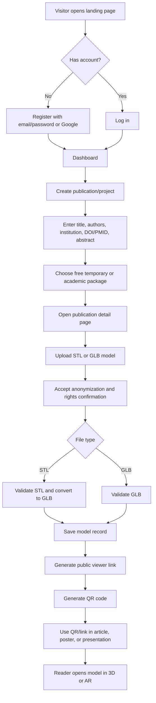
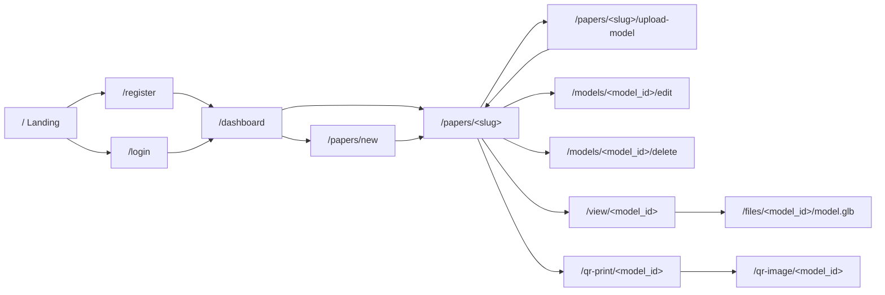
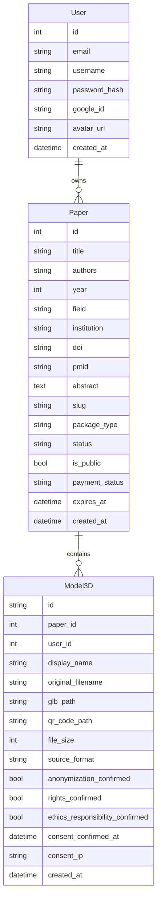
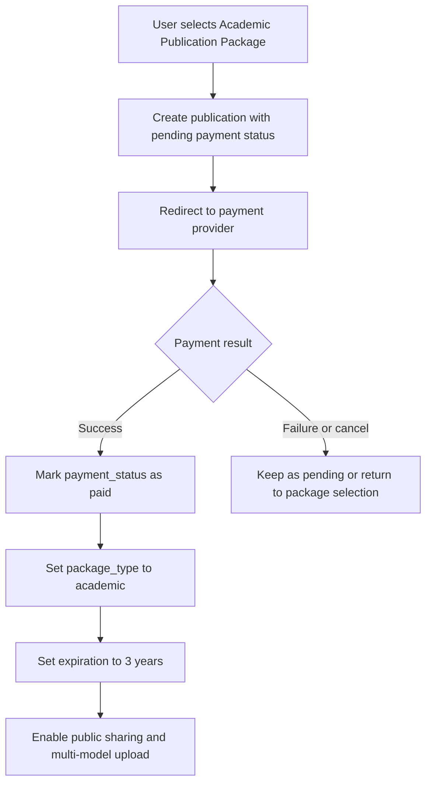

# AcademicAR Project Description

## 1. Product Vision

AcademicAR is a web platform for sharing 3D and AR-ready models alongside academic publications, posters, presentations, theses, and research projects.

The core idea is simple: an academic user uploads a segmentation or anatomical model, the platform converts or prepares it for browser-based 3D viewing, generates a public link and QR code, and lets readers inspect the model in 3D or AR from a phone, tablet, or desktop browser.

The MVP focuses on making academic 3D model sharing fast, reliable, and publication-friendly:

- Upload an STL or GLB model.
- Convert STL files to GLB for web and AR compatibility.
- Create a publication/project page.
- Generate a shareable link and QR code.
- Capture standard model screenshots.
- Allow external readers to view the model without logging in.
- Keep the compliance responsibility explicit for patient-derived or sensitive models.

## Active MVP Planning Note

The implementation source of truth for the next MVP phase is `MVP_IMPLEMENTATION_PLAN.md`.

The product is moving toward a model-based licensing system, managed QR resolver URLs, Railway-first deployment, portable storage, background workers, and expanded model conversion support for direct GLB upload plus STL, OBJ, and FBX conversion to AR-ready GLB.

While this work is implemented, preserve the existing AcademicAR / Ventriloc design language from `DESIGN.md` and avoid breaking current working flows: authentication, publication management, optional PDF upload, model upload, compliance consent, public viewer pages, QR pages, screenshots, and existing processing states.

## 2. Target Users

Primary users are academics, clinicians, researchers, graduate students, and medical visualization teams who want to attach interactive 3D content to scholarly work.

Typical use cases include:

- Adding a QR code to a journal article, poster, thesis, or conference presentation.
- Sharing a 3D reconstruction of a segmentation model.
- Publishing anatomical, surgical, engineering, archaeological, or scientific 3D models.
- Letting readers inspect a model directly from a mobile device.
- Demonstrating the model in AR during teaching, presentation, or review.

## 3. Current Technology Stack

The current application is a Flask-based web app with server-side rendered pages.

### Backend

- Python
- Flask
- Flask-SQLAlchemy
- Flask-Login
- Flask-Migrate
- Flask-WTF / CSRF protection
- Authlib for optional Google OAuth
- PostgreSQL support through `DATABASE_URL`
- SQLite fallback for local development

### 3D Processing

- STL validation
- GLB validation
- STL to GLB conversion with `trimesh`
- Mesh color support during conversion
- Runtime storage folders for uploaded, converted, QR, and PDF files

### Frontend

- Jinja2 templates
- Tailwind CDN
- Custom CSS in `static/css/style.css`
- Google `<model-viewer>` for 3D and AR rendering
- WebGL canvas screenshots through `model-viewer.toDataURL()`

### Generated Assets

- QR codes generated with the Python `qrcode` package
- Public model viewer links
- Print-friendly QR page
- Downloadable screenshot images from predefined camera angles

### Deployment

- Railway-ready configuration through `Procfile` and `railway.json`
- Gunicorn production command
- PostgreSQL support for Railway or another hosted database
- Runtime local folders are currently suitable for demo/pilot use, but long-term production storage should move to object storage.

## 4. Existing Product Features

### Authentication

- Email and password registration
- Email and password login
- Logout
- Optional Google login
- User-specific dashboard

### Publication / Project Management

Users can create a publication or project record with metadata such as:

- Title
- Authors
- Year
- Field
- Institution
- DOI
- PMID
- Abstract or description
- Optional PDF upload
- Package type

Each publication receives a unique slug and belongs to the authenticated user.

### Model Upload

The platform currently supports:

- STL upload
- GLB upload
- STL validation before conversion
- GLB header validation
- STL to GLB conversion
- Optional display name
- Optional model note / description
- Optional color during STL conversion
- One-model limit for temporary/free publications
- Multi-model-ready data model for paid academic publications

### Public Model Viewer

Each uploaded model receives a public viewer route:

```text
/view/<model_id>
```

The viewer page provides:

- Full-screen 3D model viewing
- Camera controls
- Auto-rotation
- AR button through `model-viewer`
- Publication metadata drawer
- Model metadata
- Loading and error states
- Screenshot buttons for front, right, left, top, and perspective views

### QR Code

Each model receives:

- A generated QR image
- A QR image endpoint
- A print-friendly QR page
- A public link encoded in the QR code

The intended publication workflow is that users place this QR code in:

- Manuscripts
- Posters
- Slides
- Handouts
- Teaching materials
- Supplementary documentation

### Access Duration

The current data model already separates package behavior:

- Temporary publications expire after 3 days.
- Academic package publications are intended to stay active for 3 years.

Expired publications return a not-found response for public model and QR routes.

## 5. Planned MVP Offering

### Free Temporary Publication

Price: `0 TL`

Included:

- Model upload
- 3-day temporary public link
- 3D web viewer
- QR code generation
- Screenshot capture
- One model per publication

Purpose:

- Trial usage
- Quick review sharing
- Short-lived academic demonstrations

### Academic Publication Package

Price: `500 TL`

Included:

- 3-year active publication link
- Permanent QR code during the package period
- Public sharing
- Multiple model support
- Publication metadata fields
- Author, institution, DOI, and PMID fields
- 3D and AR viewing
- Screenshot capture

Purpose:

- Real academic publications
- Conference posters
- Long-term article or thesis references
- Public research model archive pages

## 6. Compliance, Privacy, and KVKK Requirements

Some uploaded models may originate from patient data. For this reason, KVKK and privacy compliance must be treated as a core product requirement, not as an optional note.

The platform must clearly show this warning before upload:

> Uploaded models must be anonymized. Uploading files that contain a patient name, protocol number, face, identity information, or any identifying data is prohibited.

Users must explicitly check the following confirmation before uploading a model:

> I confirm that this model has been anonymized, that I have the right to share/publish it, and that I am responsible for the required ethics, consent, and approval processes.

The current implementation already stores consent-related fields on the model record:

- `anonymization_confirmed`
- `rights_confirmed`
- `ethics_responsibility_confirmed`
- `consent_confirmed_at`
- `consent_ip`

Recommended compliance improvements:

- Keep the upload checkbox mandatory.
- Store the exact consent text version accepted by the user.
- Add a dedicated Terms of Use page.
- Add a Privacy Policy and KVKK clarification text.
- Add a model removal / takedown request workflow.
- Add admin review tools for reported content.
- Avoid storing original STL files longer than necessary after conversion.
- Add automatic metadata stripping where technically possible.
- Add stronger warnings for facial or directly identifiable anatomy.

## 7. Main User Flow



## 8. Page and Route Flow



## 9. Data Model Overview



## 10. How It Works

### 1. Upload the Model

The user uploads a segmentation or 3D model from their account. The MVP currently supports STL and GLB. OBJ support is a planned extension.

### 2. Create the Publication Page

The user enters academic metadata, including title, authors, institution, DOI or PMID, abstract, and model notes.

### 3. Generate Link and QR

The system automatically creates a public viewer link and QR code for the model.

### 4. View in 3D or AR

Readers open the link directly or scan the QR code. The model can be rotated, zoomed, inspected in a browser, and opened in AR on supported mobile devices.

### 5. Capture Screenshots

The viewer can capture standard publication-friendly screenshots:

- Front
- Right
- Left
- Top
- Perspective

## 11. Production Architecture Direction

The current runtime filesystem is acceptable for local development, demos, and early pilots. For production, long-lived model and QR files should move to durable object storage.

Recommended production components:

- Application: Flask + Gunicorn
- Database: PostgreSQL, preferably Supabase PostgreSQL or managed Railway/Postgres
- File storage: AWS S3, Cloudflare R2, or Supabase Storage
- Authentication: Email/password plus Google login
- Payments: iyzico, PayTR, or Stripe depending on legal and market requirements
- Queue worker: Celery/RQ/Arq for large model conversion jobs
- Cache/rate limit: Redis
- CDN: Cloudflare for public GLB and QR delivery
- Monitoring: Sentry or equivalent error tracking

## 12. Payment Flow Direction

The paid academic package should follow this flow:



Payment provider candidates:

- iyzico
- PayTR
- Stripe

For Turkey-focused launch, iyzico or PayTR may be more practical. Stripe can remain an international option.

## 13. Near-Term Development Roadmap

### MVP Completion

- Finalize English product copy across all pages.
- Add OBJ upload support or clearly label OBJ as planned.
- Add payment provider integration.
- Enforce package limits consistently.
- Add paid package activation after successful payment.
- Move production file storage to S3, R2, or Supabase Storage.
- Add durable public file URLs for GLB and QR files.
- Add package and expiration status UI in dashboard.
- Add clearer QR download and print actions.

### 3D and AR Improvements

- Add model thumbnails.
- Add automatic preview generation after upload.
- Add server-side screenshot generation for consistent publication exports.
- Add Draco mesh compression.
- Add large file background processing.
- Add upload progress.
- Add model scale controls and unit selection.
- Add optional model orientation correction.
- Add support for multiple models in a single viewer scene.

### Academic Publishing Features

- Public publication landing page with all models listed.
- Citation-friendly metadata display.
- DOI and PMID link validation.
- ORCID support for authors.
- BibTeX or citation export.
- Embeddable viewer iframe.
- Institution/team pages.
- Private reviewer links.

### Admin and Operations

- Admin dashboard.
- User and publication moderation.
- Content report workflow.
- Payment and invoice records.
- Storage usage reporting.
- Expiration reminders before links become inactive.
- Manual extension or renewal tools.

### Security and Compliance

- Terms of Use, Privacy Policy, and KVKK pages.
- Consent text versioning.
- Audit logs for upload and publication events.
- Malware scanning for uploads.
- Stronger rate limiting with Redis.
- Admin takedown workflow.
- Automated cleanup for expired temporary publications.

## 14. Open Product Decisions

The following decisions should be finalized before production launch:

- Whether paid publication links are truly permanent or active for a fixed 3-year period.
- Whether users can renew paid links after 3 years.
- Whether temporary free links are publicly indexable or unlisted only.
- Whether uploaded PDFs should be part of public publication pages or owner-only files.
- Whether model download should ever be allowed, or only web viewing.
- Which payment provider will be used for the first launch.
- Which object storage provider will be used for production.
- Whether all paid publications require manual review before public listing.

## 15. Success Criteria for MVP

The MVP can be considered successful when:

- A user can register and log in.
- A user can create a publication/project.
- A user can upload a valid STL or GLB model.
- STL files are converted to GLB successfully.
- A public viewer link is generated.
- A QR code is generated and can be used in print or digital materials.
- A reader can open the model without logging in.
- A mobile user can open AR mode on supported devices.
- Screenshot buttons generate usable image exports.
- Free links expire after 3 days.
- Paid links remain active for 3 years after payment.
- Patient-data compliance warnings and upload confirmations are mandatory.
- Production files are stored durably outside the ephemeral app filesystem.
